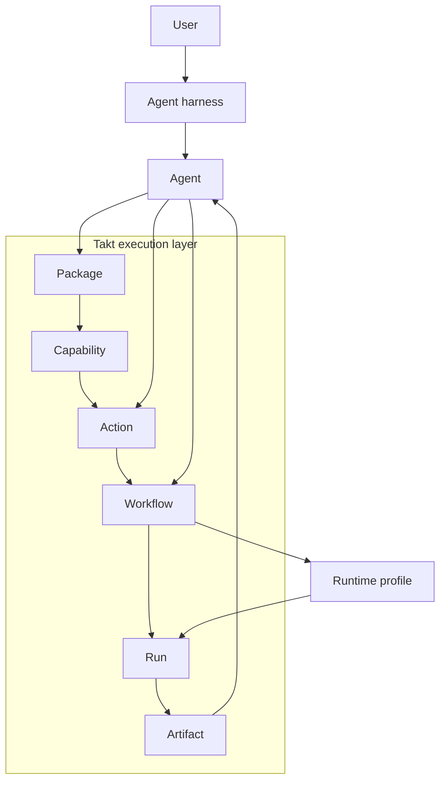

# Takt 🔥

Most of the energy around agents right now is going into layers that sit above them. Better harnesses, better planners, better orchestration, better ways of steering a model through a task. That work matters, but it often leads to a familiar outcome: the framework becomes the product, and the agent becomes a guest inside it.

Takt starts from a different assumption. The agent should remain the main interface. The harness is where the user asks for work, reviews progress, and iterates. The framework should live underneath that experience as an execution layer the agent can inspect, extend, and run.

That is what Takt is for. It gives agents a set of primitives for turning one-off work into something more durable: packaged capabilities, project-local actions, composable workflows, and execution artifacts that can be inspected and reused later.

The current implementation is written in Rust and exposes a CLI and MCP server.

## The Bet

Most systems around agents are trying to become the place where work happens. They add planners, orchestration, workflow engines, memories, and runtimes until the framework becomes the product and the agent becomes one more component inside it.

I think that is the wrong center of gravity.

The user is already building a relationship with the agent harness. That is where intent is expressed, progress is reviewed, and taste enters the loop. Replacing that interface with a separate automation framework creates a second product to learn and a second place where context gets trapped.

Takt takes the opposite route. It lives below the harness. The agent remains the thing you talk to. Takt becomes the thing the agent can rely on when ad hoc work wants to harden into structure. A successful prompt can become a reusable capability. A capability can be configured for a project as an action. Actions can be composed into workflows. Workflows can run inside reviewed runtimes and leave behind artifacts the agent can inspect or build on later.

That split matters because it preserves what each layer is good at. The agent stays fluid, conversational, and close to the user. Takt stays explicit, inspectable, and executable. One is the interface. The other is the substrate.



The core object model inside Takt is:

`package -> capability -> action -> workflow -> run -> artifact`

## Runtime Model

Capabilities execute on named runtime profiles. A runtime profile declares the sandbox, pinned OCI image, CPU and memory limits, and network policy for execution. The current direction points toward reviewed, constrained runtimes instead of ad hoc shell scripts.

## Current Surface

The current CLI and MCP surface centers on:

- `takt concepts` to explain the core nouns
- `takt schema` to emit machine-readable schemas
- `takt init` to scaffold a package
- `takt generate action` and `takt generate workflow` to create starter manifests
- `takt validate` to check package and manifest correctness
- `takt run` to plan action and workflow runs
- `takt mcp` to expose the same model through MCP

## Design Principles

Takt is built around a few core principles:

- one shared core for CLI and MCP behavior
- structured output for agent-friendly automation
- thin agent skills that route to executable interfaces instead of duplicating behavior in markdown

## Command Examples

```sh
takt concepts
takt schema all --format json
takt init
takt validate
takt run action <name>
takt mcp
```

## License

MIT
